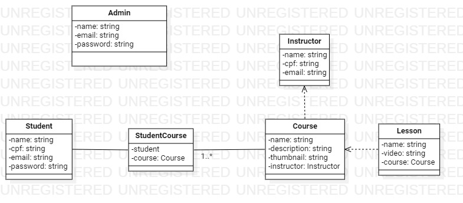
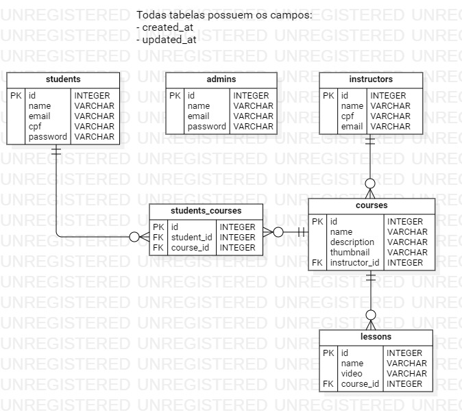

## 

<br/>

# Objetivo

## Nosso projeto chamado Tech Learning tem o principal objetivo de oferecer cursos (voltados para a TI) gratuitos para a comunidade. Os cursos são direcionados as pessoas com baixa renda que desejam se profissionalizar na área de TI em geral. Os cursos são feitos e doados por profissionais que se compadecem pela causa da empresa.

<br/>

# Público-alvo

## Pessoas de baixa renda que tem interesse em se profissionalizar na vasta área de TI.

<br/>

# Mercado

## Tecnologia no geral.

<br/>

# Forma de faturamento:

## Através do patrocínio de terceiros e/ou doações.

<br/>

# Regra de negócios / Requisitos funcionais

### Admin

- CRUD Instrutores;
- CRUD Cursos;
- RUD Alunos;

### Aluno

- Listar cursos;
- Visualizar um curso (Aula);
- Se inscrever em um curso.
- Não poder visualizar um curso em que não esteja inscrito.

# Diagramas

## Classe



## Entidade e Relacionamento



# Projeto

<!-- A documentação de referência da API no formato Swagger poderá ser encontrada através desse [link](https://app.swaggerhub.com/apis-docs/Manfrinmm/VUTTR-API/1.0) -->

<!-- <div align="center" >

[](https://insomnia.rest/run/?label=Tech-Learning &uri=https://github.com/Manfrinmm/projeto-daw-tech-learning/docs/Template insomnia de requisições.json)

Para utilizar documentação de referência no insomnia basta clicar no batão acima

</div> -->

# 🚀 Tecnologias usadas

- [Spring Boot](https://spring.io/projects/spring-boot)
- [Docker](https://www.docker.com/)

# 📋 Requisitos mínimos para rodar o projeto localmente

- Java instalado na versão 11.x
- Docker e Docker compose (opcional)
- Ter uma instância do MySQL para que o JPA possa se conectar

# 🤹‍♂️ Como utilizar localmente

- Clone o repositório:

  ```bash
  git clone https://github.com/Manfrinmm/projeto-daw-tech-learning
  ```

- Abra o projeto no Spring Tool Suite (STS) ou qualquer outro editor compatível.
- Crie a Database no MySQL.
- Inicie o projeto no STS e basta utilizar.

# 🛠 Status do projeto

## Versão 1.0

### Admin

- **CRUD** Instrutores;
- **CRUD** Cursos;
- **RUD** Alunos;

### Aluno

- Listar cursos;
- Visualizar um curso (Aula);
- Se inscrever em um curso.
- Não poder visualizar um curso em que não esteja inscrito.

---

Made by Matheus Menezes Manfrin 🦥 [See my LinkedIn](https://www.linkedin.com/in/matheusmmm/)
